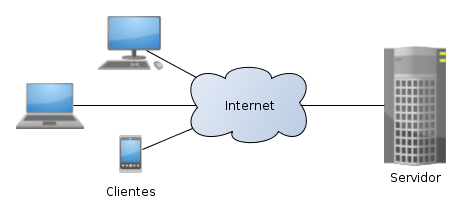

<!-- PROJECT LOGO -->
<br />
<p align="center">
  <a href="https://github.com/citi-onboarding/pta-boilerplate">
    
  </a>

  <h3 align="center">PTA</h3>

  <p align="center">
  Este boilerplate foi criado em 2025.1 com a proposta de trazer a frente mobile para o Processo de Treinamento de Área (PTA) do CITi. Ele foi desenvolvido com base no boilerplate utilizado nos processos seletivos de 2022 e atualizado em 2023.2, que tinha como objetivo aproximar as pessoas aspirantes da realidade dentro da empresa. Esta nova versão mantém esse propósito, ao mesmo tempo em que amplia a capacitação técnica, alinhando-se às demandas atuais da empresa.
    <br />
    <a href="https://github.com/citi-onboarding/pta-boilerplate"><strong>Explore the docs »</strong></a>
    <br />
    <br />
    ·
    <a href="https://github.com/citi-onboarding/pta-boilerplate/issues">Report Bug</a>
    ·
    <a href="https://github.com/citi-onboarding/pta-boilerplate/issues">Request Feature</a>
  </p>
</p>

<!-- TABLE OF CONTENTS -->
<details open="open">
  <summary><h2 style="display: inline-block">Tabela de Conteúdo</h2></summary>
  <ol>
    <li><a href="#about-boilerplate">About Boilerplate</a></li>
    <li><a href="#server">Server</a></li></li>
    <ul>
        <li><a href="#how-to-install">How To Install</a></li></li>
        <li><a href="#how-to-run">How To Run</a></li></li>
        <li><a href="#citi-abstraction-documentation">Citi Abstraction Documentation</a></li></li>
        <ul>
        <li><a href="#are-values-undefined">Are Values Undefined</a></li></li>
        <li><a href="#insert-into-database">Insert Into Database</a></li></li>
        <li><a href="#get-all">Get All</a></li></li>
        <li><a href="#find-by-id">Find By ID</a></li></li>
        <li><a href="#delete-value">Delete Value</a></li></li>
        <li><a href="#delete">Update</a></li></li>
        </ul>
    </ul>
    <li><a href="#client">Client</a></li>
        <ul>
        <li><a href="#how-to-install-client">How To Install Client</a></li></li>
        <li><a href="#how-to-run-client">How To Run Client</a></li></li>
        </ul>
    </ul>
    <li><a href="#add-new-dependencies">Add New Dependencies</a></li>
    <li><a href="#contact">Contact</a></li>
  </ol>
</details>

<br/>

## About Boilerplate

<br/>

Esse boilerplate foi criado durante o processo seletivo de 2022 do CITi e ele tem o intuito de aproximar as pessoas aspirantes à realidade
dentro do CITi. O boilerplate será usado durante a última etapa do processo seletivo, a qual tem o objetivo de capacitar tecnicamente as pessoas que entrarão no CITi.
O template foi criado em um monorepo e está estruturado em cliente (mobile) e servidor.

<p align= "center">
    
</p>

O server contém uma estrutura base de código voltada à construção de uma API, incluindo uma abstração pensada para facilitar o contato inicial das pessoas aspirantes com o desenvolvimento de back-end. Já o cleint, apresenta uma base de código para a construção de toda a interface web da aplicação. A nova pasta mobile traz uma estrutura inicial para o desenvolvimento da versão mobile da aplicação, ampliando o escopo técnico e alinhando-se às frentes utilizadas em projetos reais do CITi.

<br/>

## Pré-requisitos

Certifique-se de ter instalado antes de começar:

- [Node.js](https://nodejs.org/)
- [pnpm](https://pnpm.io/)
  ```bash
  npm i -g pnpm
  ```
- [Docker Desktop](https://www.docker.com/products/docker-desktop/)
- [Expo Go](https://expo.dev/go) no celular (para o mobile)

---

## Server

### Instalação Server

1. Clone o repositório

   ```bash
   git clone https://github.com/citi-onboarding/pta-squad-gabriel.git
   ```

2. Entre na pasta `/server` e instale as dependências

   ```bash
   cd server
   pnpm install
   ```

3. Crie o arquivo `.env` dentro da pasta `/server` com o seguinte conteúdo:

   ```env
   # GENERAL SETTINGS
   PROJECT_NAME=pta
   SERVER_PORT=3001

   # DATABASE SETTINGS
   DATABASE_TYPE=postgres
   DATABASE_HOST=${PROJECT_NAME}-db
   DATABASE_PORT=5432
   DATABASE_USER=postgres
   DATABASE_PASSWORD=docker
   DATABASE_DB=${PROJECT_NAME}

   DATABASE_URL=${DATABASE_TYPE}://${DATABASE_USER}:${DATABASE_PASSWORD}@${DATABASE_HOST}:${DATABASE_PORT}/${DATABASE_DB}

   # EMAIL SETTINGS
   SMTP_HOST=smtp.gmail.com
   SMTP_PORT=587
   SMTP_USER=
   SMTP_PASS=
   ```

### Rodando Server

1. Com o Docker Desktop aberto, suba o banco (deixe esse terminal rodando):

   ```bash
   docker compose up
   ```

2. Aguarde aparecer `database system is ready to accept connections`.
3. Abra outro terminal na pasta `/server` e rode a migration:
   ```bash
   pnpm migration
   ```
   > Ao aparecer `Enter a name for the new migration:`, digite algo como `init`.  
   > Rode esse comando novamente sempre que modificar o `schema.prisma`.
4. Ainda na pasta `/server`, suba o servidor:
   ```bash
   pnpm run dev
   ```

O server estará disponível em `http://localhost:3001`.

---

## Client

### Instalação Client

1. Entre na pasta `/client` e instale as dependências:

   ```bash
   cd client
   pnpm install
   ```

2. Crie o arquivo `.env.local` dentro da pasta `/client`:
   ```env
   NEXT_PUBLIC_API_URL=http://localhost:3001
   ```

### Rodando Client

1. Na pasta `/client`, rode:
   ```bash
   pnpm run dev
   ```

O client estará disponível em `http://localhost:3000`.

---

## Mobile

### Instalação Mobile

1. Entre na pasta `/mobile` e instale as dependências:
   ```bash
   cd mobile
   pnpm install
   ```

### Rodando Mobile

1. Na pasta `/mobile`, rode:

   ```bash
   pnpm run start
   ```

2. Um QR Code aparecerá no terminal. Escaneie com o **Expo Go** no celular.
   > **Obs:** seu computador e celular precisam estar na mesma rede Wi-Fi.

---

## Dependências

Não instale novas dependências sem autorização do gerente do projeto. Caso necessário, converse antes de adicionar qualquer pacote.

---

## Contact

<br/>

- [Alex Damascena](https://github.com/apfdamascena), líder de desenvolvimento em 2022.1 - apfd@cin.ufpe.br
- [Tiago Lima](https://github.com/titi-lima), líder de desenvolvimento em 2023.2 - tmsl@cin.ufpe.br
- [Thaís Neves](https://github.com/thaisnevest), líder de desenvolvimento em 2025.1 - tns2@cin.ufpe.br

## 2025 Boilerplate

<br/>

- [apfdamascena/pta-boilerplate](https://github.com/apfdamascena/pta-boilerplate)
